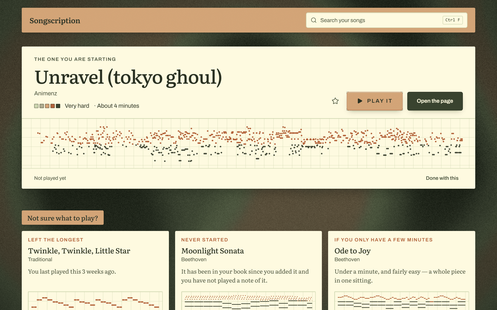
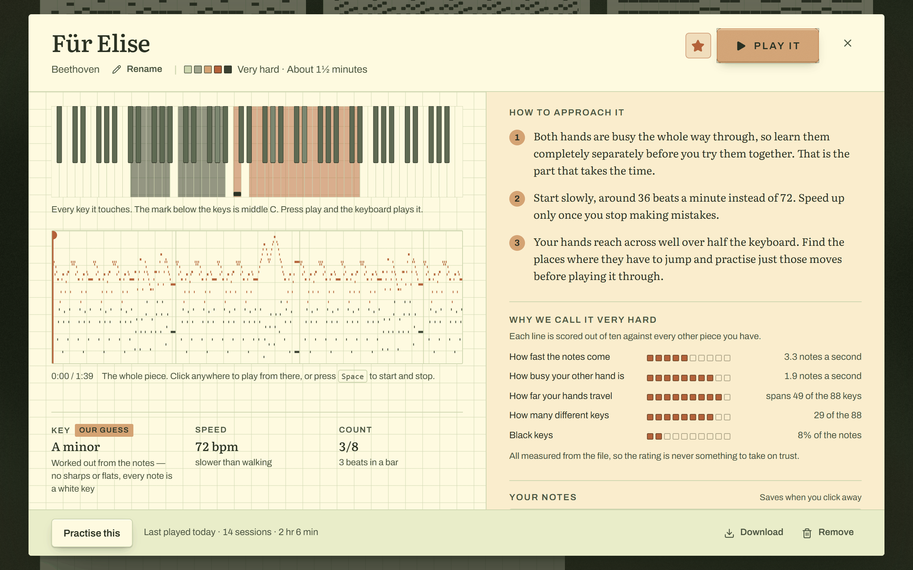
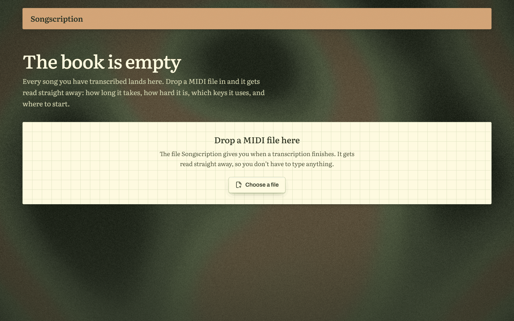
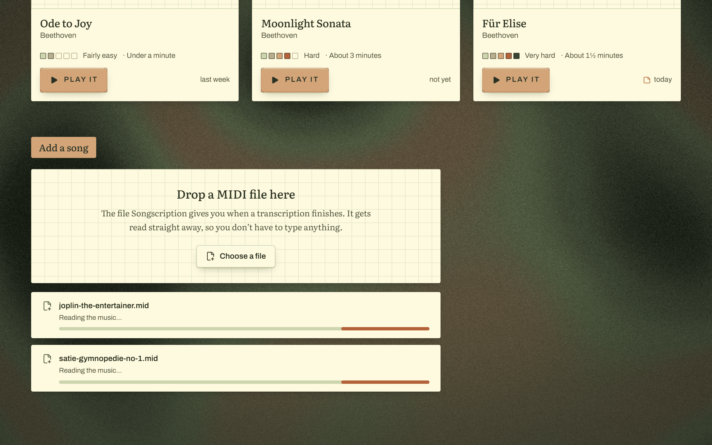
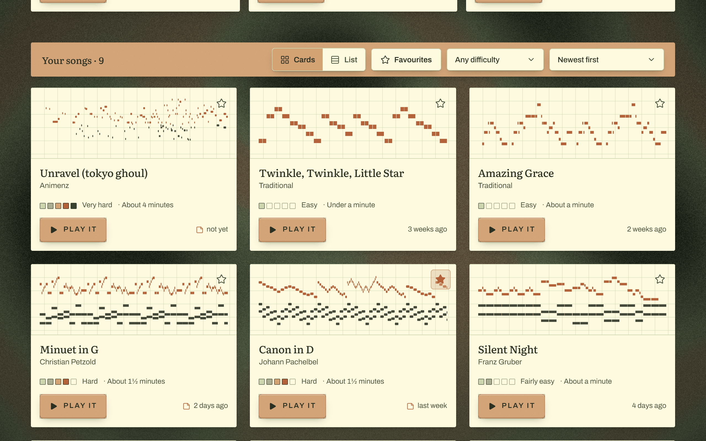
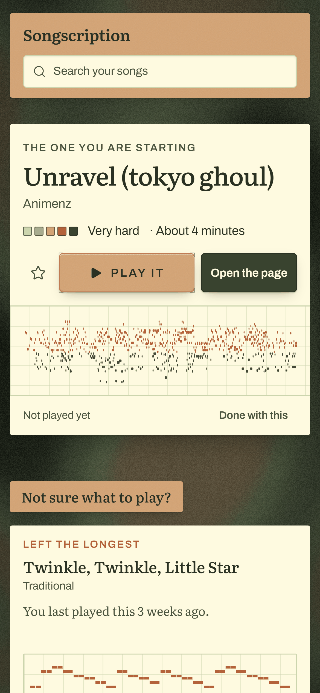
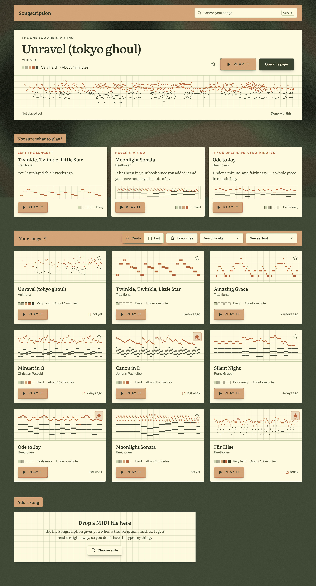

# Songscription catalogue

Live: **https://songscription-takehome.vercel.app** — password `songscription123`



```bash
npm install
cp .env.example .env.local   # Supabase keys
npm run dev
npm test
```

Without keys it still runs, read-only, over the nine files in `public/seed/`. With keys, run
`supabase/schema.sql` once and `npm run seed-db`. `public/demo/` has seven more files for testing
uploads.

## Who I built for

Someone learning piano who can't read music. That's the harder user, and I think it's the real one.

So every musical fact comes with what it means for the player. Not "A minor" but "no sharps or
flats, every note is a white key". Not "72 bpm" but "slower than walking".

---

## Decisions

**Supabase.** Rows in the database, the MIDI files in storage. It's what you use, and it gave me
search and data checks without extra work.

**Duplicates are caught by the database, not by comparing filenames.** Filenames lie, and two
uploads at once will beat any check written in app code. The second upload gets told which song it
already matches.

**Only practice history can be edited.** Anything measured from the file is locked. If difficulty
could be hand-edited, the app would be showing a wrong number with full confidence.

**Search runs in two places.** The browser filters what it already has, so typing never waits.
A moment later the database answers too, because it can see songs the page hasn't loaded yet.

**Difficulty scores each hand, not the biggest chord.** My first version scored the largest chord,
which rated Silent Night as harder than Für Elise. Slow fat chords are easy. What takes weeks is
both hands being busy at once, so it measures each hand and scores the quieter one.

It also shows the five things it measured and what they read. A 1–5 score on its own is something
the learner has to take on trust.



**Every thumbnail is the song's own notes.** Not an icon, not a waveform. Time across, pitch up,
right hand red and left hand black. It's the only thing that makes a long catalogue scannable
without reading titles.

**For "I don't know what to play", three picks that say why.** *Left the longest* / *Never started*
/ *If you only have a few minutes.* A recommendation score would have been easier, but you can't
argue with a score. Each pick prints the fact that chose it, and a slot with nothing to put in it is
dropped rather than filled with a wrong reason.

**Controls appear when they're needed.** Empty: one line and a drop zone, no search box. Under 8
songs: no filters. Under 4: no suggestions. Four ways to narrow three songs is noise.



**48 cards, then "show more".** Drawing all 300 made typing lag about 400ms, because each card is
real note data. Virtualising is the better fix; capping is what fit in the time.

**No settings page.** That's where you put decisions you couldn't make. Renaming, composer,
favourite and your notes live on the song itself. The cards/list toggle is remembered. Sort and
filters are deliberately not, because a filter restored on load looks like your songs disappeared.

**Upload says what went wrong.** Several files at once, one progress row each. Errors name the
problem and the fix in plain words: wrong file type, empty file, no notes in it, connection dropped.
Failures stay until dismissed, successes clear themselves.



**It plays.** The piano is built in the browser rather than loaded as recorded audio, which would be
megabytes. Notes are queued about a second ahead instead of all at once, so a long song doesn't
freeze the tab. The keyboard lights up as it plays, and you can click anywhere on the roll to start
from there.

---

## What's made up

Practice history only — last played, how many sessions, total time. Everything else is read from the
file. The song page says which is which.

## With more time

1. Rank search results, so a title match beats a filename match.
2. Virtualise the grid instead of capping it.
3. Make practice real. The player already knows how long you played.

## Stack

Next.js, TypeScript, Tailwind, Supabase. Deployed on Vercel behind a shared password.

Worth reading: [`src/lib/midi.ts`](src/lib/midi.ts) reads the file and works out difficulty,
[`src/lib/audio.ts`](src/lib/audio.ts) is the piano, [`supabase/schema.sql`](supabase/schema.sql) is
the data model.

<details>
<summary>More screenshots</summary>





</details>
